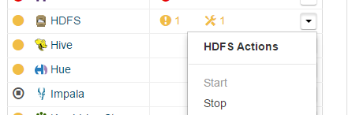
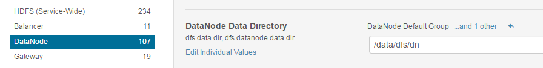

# Apache Hadoop - How to change Data Directory (with data migration)

### Introduction

In this document I will try to explain how to change the data directory in HDFS service on CDH system (Cloudera Manager). This process involves migrating data to the new location.

### Steps

1. CDH: First all, stop HDFS service. On the Home page, click to the right of the service name and select Stop.



2. CDH: Select HDFS Configuration > View and Edit.
3. CDH: Click the DataNode Data Directory property 

> In this case, the original value is /dfs/dn

4. CDH: Remove the current directories and add new ones.

> The new directory will be /data/dfs/dn
> Must have write permissions for user hdfs



5. SHELL: Copy all content from old directory to new directory (all nodes).

```bash
$ sudo cp -avr /dfs/dn /data/dfs/dn
```

6. CDH: Click Save Changes to commit the changes.
7. CDH: Start HDFS Service


### Problem with block missing

After the previous operations, maybe in HDFS status summary in CDH, you see the an alert about missing blocks and underreplicated blocks. To fix:

```bash
$ sudo su hdfs
$ hdfs fsck / -delete
```

### References

http://www.cloudera.com/documentation/archive/manager/4-x/4-8-4/Cloudera-Manager-Managing-Clusters/cmmc_hdfs_storagedir.html