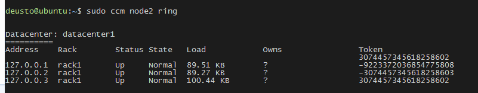
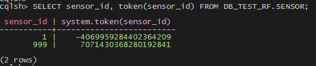
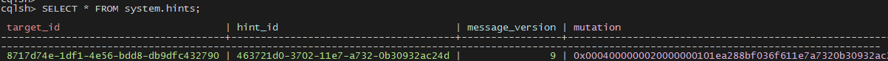
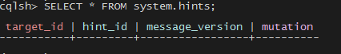

# CCM Cassandra Setup

### Caveats

+ A working python installation (tested to work with python 2.7).
+ pyYAML (http://pyyaml.org/ -- sudo easy_install pyYaml)
+ six (https://pypi.python.org/pypi/six -- sudo easy_install six)
+ ant (http://ant.apache.org/, on Mac OS X, brew install ant)
+ psutil (https://pypi.python.org/pypi/psutil)

### Install

```bash
$ sudo apt-get install python-pip
$ sudo pip install pyYAML six ant psutil
$ sudo pip install --upgrade pip
```

### Exercise 1: First Operations

##### Create Cluster Cassandra

```bash
$ sudo ccm create cluster_cassandra -v 2.2.9 -n 3
```

##### Show Status Cluster

Cluster list

```bash
$ sudo ccm list
```

Cluster status

```bash
$ sudo ccm status
```

Node cluster status

```bash
$ sudo ccm node1 show
```

##### Connect CQL

```bash
$ sudo ccm node1 cqlsh
```

### Exercise 2: Replication

Inside CQL console...

##### Create Keyspace

With Replication Factor 1

```sql
CREATE KEYSPACE IF NOT EXISTS DB_TEST WITH REPLICATION = { 'class' : 'SimpleStrategy', 'replication_factor' : 1 };
```

With Replication Factor 3

```sql
CREATE KEYSPACE IF NOT EXISTS DB_TEST_RF WITH REPLICATION = { 'class' : 'SimpleStrategy', 'replication_factor' : 3 };
```

Show keyspaces

```sql
DESC KEYSPACES;
```

##### Create a Column Families

```sql
CREATE TABLE IF NOT EXISTS DB_TEST.SENSOR (
sensor_id int,
sensor_name text,
ts timestamp,
PRIMARY KEY (sensor_id,ts)) WITH CLUSTERING ORDER BY (ts DESC);

CREATE TABLE IF NOT EXISTS DB_TEST_RF.SENSOR (
sensor_id int,
sensor_name text,
ts timestamp,
PRIMARY KEY (sensor_id,ts)) WITH CLUSTERING ORDER BY (ts DESC);
```

Show Column Families

```sql
DESC COLUMNFAMILIES;
```

##### Insert a row

**_Case 1_**

```sql
INSERT INTO DB_TEST.SENSOR (sensor_id, sensor_name, ts) VALUES (1,'air polution',dateof(now()));
```

**Case 2**

```sql
BEGIN BATCH
INSERT INTO DB_TEST_RF.SENSOR (sensor_id, sensor_name, ts) VALUES (1,'air polution',dateof(now()));
INSERT INTO DB_TEST_RF.SENSOR (sensor_id, sensor_name, ts) VALUES (999,'air flow meter',dateof(now()));
APPLY BATCH;
```

##### Verify

**Case 1**

```sql
SELECT sensor_id, token(sensor_id) FROM DB_TEST.SENSOR;
```

Another way. Return data in JSON format!
```sql
SELECT JSON sensor_id, token(sensor_id) FROM DB_TEST.SENSOR;
```




**Case 2**

SELECT sensor_id, token(sensor_id) FROM DB_TEST_RF.SENSOR;



**Questions**

- What is the coordinator node?
- How many copies are there?
- Where are the originals and copies?

**Solution**

In other ssh session, launch:

```bash
sudo ccm node1 nodetool getendpoints db_test sensor 1;
sudo ccm node1 nodetool getendpoints db_test_rf sensor 999;
```

### Exercise 3: Fail Over

##### Calcule token

We use sensor_id = 2. Discover the associated token:

```bash
$ sudo ccm node1 nodetool getendpoints db_test_rf sensor 2;
```

##### Shutdown the node

```bash
$ sudo ccm node2 stop
```

##### Insert Row

Connect to CQL node1

```bash
$ sudo ccm node1 cqlsh
```

```sql
INSERT INTO DB_TEST_RF.SENSOR (sensor_id, sensor_name, ts) VALUES (2,'speed sensor',dateof(now()));
```

```sql
SELECT * FROM DB_TEST_RF.SENSOR;
```

##### Verify hints table for the fallen node

```sql
SELECT * FROM system.hints;
```




##### Start the node

```bash
$ sudo ccm node2 start
```

##### Check again hints table

```sql
SELECT * FROM system.hints;
```




