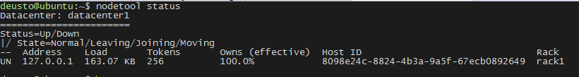

# Cassandra Setup

### Caveats

This guide is based on operating system **Ubuntu 16.04.2 LTS (Xenial)**

### Prerequisites

- Python 2.7 >
- Latest version of Oracle Java Platform, Standard Edition 8 (JDK) or OpenJDK 8.

### Install JDK (if it isn't installed)

```bash
$ echo "deb http://ppa.launchpad.net/webupd8team/java/ubuntu xenial main" | tee /etc/apt/sources.list.d/webupd8team-java.list
$ echo "deb-src http://ppa.launchpad.net/webupd8team/java/ubuntu xenial main" | tee -a /etc/apt/sources.list.d/webupd8team-java.list
$ apt-key adv --keyserver hkp://keyserver.ubuntu.com:80 --recv-keys EEA14886
$ apt-get update
$ apt-get install oracle-java8-installer
```

After installing it, verify that it's now the default JRE:

```bash
$ java -version
```


### Install Cassandra

```bash
$ echo "deb http://debian.datastax.com/community stable main" | sudo tee -a /etc/apt/sources.list.d/cassandra.sources.list
$ curl -L https://debian.datastax.com/debian/repo_key | sudo apt-key add -
$ sudo apt-get update
$ sudo apt-get install cassandra cassandra-tools
$ sudo update-rc.d cassandra enable
```

We need to allow remote connections through thrift RPC service . For that, we should edit cassandra.yaml

```bash
$ sudo vi /etc/cassandra/cassandra.yaml
```

Changes are:

```vim
# Whether to start the thrift rpc server.
start_rpc: true
# port for Thrift to listen for clients on
rpc_port: 9160
```

Only for local connections:

```vim
listen_address: 127.0.0.1
rpc_address: 127.0.0.1
```

Restart Service

```bash
$ sudo service cassandra restart
```

### Check service

Connect to CQL prompt

```bash
cqlsh 127.0.0.1
```


```bash
nodetool status
```

